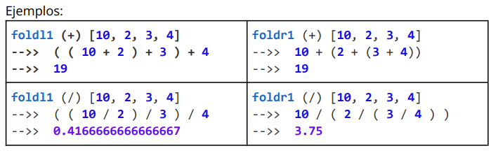

# Introducción al orden superior

## Cohesión de los componentes

Una función es más cohesiva que otra si se enfoca en menos objetivos a la vez. Al disminuir la cohesión, no solo tengo más responsabilidades para cubrir, sino que es más probable cometer errores: puedo equivocarme en el criterio para filtrar, o en el algoritmo que recorre la lista. Además un componente con menos cohesión es más difícil de testear, ya que requiere más puntos de control.

### Filter : sleccionar

```haskell
filter f[] = []
filter f (x:xs) | f x       =   x : filter f xs
                | otherwise =   filter f xs
```

#### ¿De qué tipo es filter?
 
- Recibimos una función que se verifica contra cada uno de los elementos de la lista y devuelve un Bool.
- Una lista con elementos de cualquier tipo.
- Y devolvemos la lista con los elementos que cumplen el criterio, por lo tanto debe respetar ser el mismo tipo que la lista original.

```haskell
filter :: (a -> Bool) -> [a] -> [a]
```

### Funciones como expresiones (o bloques de código)

Las funciones que reciben o devuelven funciones se llaman de orden superior: la ventaja es que permiten construir funciones más generales, recibiendo funciones que abstraen porciones de código.

## Composición y orden superior

¿Qué diferencia hay entre composición de funciones y orden superior?
`(palindromo . nombre)` vs `filter even [1..10]`

En el primer caso **se construye una función ad-hoc a partir de la composición de dos funciones existentes**. Ambas son funciones de primer orden, si coinciden el dominio e imagen de ambas funciones puedo componerlas.

En el segundo caso tenemos una función como valor de primer orden. Pasamos `even` a `filter` usa esa función que le paso como parámetro. `filter` es una función de orden superior (mientras que `even` es de orden simple).

### Map: transformación

Transforma una lista en otra aplicando una función a todos sus elementos.

```haskell
map f[] = []
map f (x:xs) = f x:map f xs
```

¿De qué tipo es map?

- Recibe una función que transforma un elemento en otro que puede ser del mismos tipo o no
  - por eso utilizamos una nueva variable de tipo, *b* puede coincidir con *a* o ser un tipo distinto.
  - la lista original de *a*s
  - y la lista resultante de *b*s

```haskell
map :: (a -> b) -> [a] -> [b]
```

### any / all : algunos o todos

Resolver una función que indique si todos los elementos de una lista cumplen una determinada condición.

```haskell
all even [1..3]
False
```

Resolver la función any, que indique si alguno de los elementos de una lista cumplen una determinada condición.

```haskell
any (elem 3) [[6..9],[2..4]]
True
```

### and / or

```haskell
and :: [Bool] -> Bool

or :: [Bool] -> Bool
```

Opera una lista de booleanos aplicándoles un and entre sí.

```haskell
and [True,True]
True

and [Ture,False,True]
False

or [True,False,True]
True

or [False,False]
False
```
Tanto any como all reciben

- Una función que evalúan sobre cada elemento d e una lista y devuelve un booleano
- Una lista de elementos
- Devuelven un valor booleano

```haskell
any :: (a -> Bool) -> [a] -> Bool

any f = or . map . f
```

any transforma los elementos en una lista de booleanos (que indica si cumplen o no el criterio pasado como parámetro), y luego se compone con or para reducirlo a un único valor booleano.

all funciona en forma análoga con la función and:

```haskell
all :: (a -> Bool) -> [a] -> Bool
all f = and . map f
```
### fold: reducción

Fold es una familia de funciones de orden superior, que tienen todas un objetivo similar: combinar los elementos de ciertas estructuras, usando una operación binaria

#### Intercalando operaciones binarias

El fold más simple que implemente esta idea es foldl1, que combina los elementos de una lista en base a una *operación binaria interna:*

```haskell
foldl1 :: (a -> a -> a) -> [a] -> a
```

#### Asociatividad

foldl1 asocia de **izquierda a derecha** (de allí la L de left de foldl1). Y foldr1, **asocia de derecha a izquierda**



#### foldl y foldr

```haskell
foldl :: (a -> b -> a) -> a -> [b] -> a
foldr :: (a -> b -> b) -> b -> [a] -> b
```

Estas variantes son análogas a foldl1 y foldr1, con la diferencia de que se toman un elemento inicial de la acumulación, llamado *seed*

Con está nueva abstracción podemos definir sum,product y concat, que ahora si soportan la lista vacía

```haskell
sum = foldl (+) 0
product = foldl (*) 1
concat = (++) []
```

Cuando la operación binaria es cerrada, es decir:

```haskell
a -> a -> a
```

el *acumulaldor* será típicamente el elemento neutro de la misma

### flip

La función flip permite recibir ua función y aplicarla con los parámetros invertidos:

```haskell
flip :: (a -> b -> c) -> b -> a -> c
flip f y x = f x y
```

### $ o función aplicación

La función $ es otra función de orden superior que permite aplicar un conjunto de parámetros a una función

```haskell
($) :: (a -> b)->(a->b)
($) f x = f x
ó
f $ x = fx 
```

Esta función permite evitar paréntesis, reduciendo 

- una función a izquierda
- un valor a derecha

```haskell
(take 1. filter even)[1..10]
take 1. filter even $ [1..10]
```