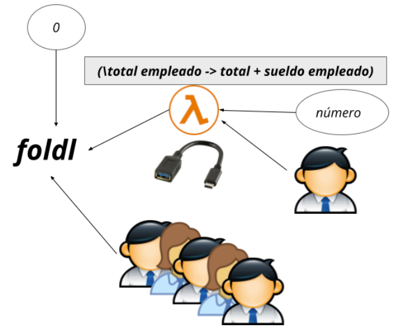

# Introducción

--- 

Haskell está basado en el cálculo lambda, que es un sistema de reglas de transformación o reductor de expresiones que diseñó Alonzo Church.

$\lambda x:x*x$ es una expresión lambda que denota la función cuadrado.

En Haskell se codifica así:

```haskell
\x -> x * x
```

Y también podemos definirla como:

```haskell
cuadrado = \x -> x * x
```

La barra invertida (\\) es el símbolo que remite a la letra griego lambda $\lambda$ que es el ícono de la programación funcional. Luego de los parámetros que se separan por espacios, la flecha `->` termina de definir el cuerpo de la función.

Se evalúa de esta manera:

```haskell
> (\x -> x* x) 2
4
```

Otro ejemplo:

```haskell
> (\x y -> x + y) 2 3
5
```

Las expresiones lambdas permiten definir funciones *anónimas* que se usan en un contexto limitado. Al no tener nombre, es una variante menos expresiva que una función cuadrado o suma, que además se puede utilizar en diferentes contextos.

## Definición local de una función 

Otra forma de escribir lo mismo

```haskell
sumar 2 3 where sumar x y = x + y
```

Si quiero saber el número de raíces de una ecuación cuadrática:

```haskell
numeroDeRaices a b c
    | discriminante > 0 = 2
    | discriminante == 0 = 1
    | discriminante < 0 = 0
where discriminante = b * b - 4 * a * c
```

Defino una expresión en un solo lugar. Tiene un nombre explícito, lo que ayuda a su comprensión y la ventaja de no tener que definirse por "afuera", aunque también sirve solamente en el contexto local de una función.

## Uso efectivo de lambdas

### Lambdas con filter y map

Las lambdas son útiles cuando queremos trabajar con funciones de orden superior y no tenemos necesidad de reutilizar una expresión en otro contexto

```haskell
λ filter (\cliente -> edad cliente > 40) clientes
```

en muchos casos podemos resolver el mismo problema con composición y aplicación parcial

```haskell
λ filter ((>40).edad) clientes
```

y **ciertamente es la opción que vamos a preferir en la cursada**, ya que no solo es más conciso el código sino que demuestra más entendimiento de los conceptos del paradigma.

Algunos contraejemplos en donde el uso de funciones anónimas nos facilita resolver ciertos requerimientos.

```haskell
λ filter ((\unaEdad -> unaEdad < 20 || unaEdad > 60) . edad) clientes
```

Otro ejemplo puede ser una función anónima ad-hoc que permite sumar los elementos de una tupla:

```haskell
λ map (\(a,b) -> a + b) [(1, 2), (3, 5), (6, 3), (2, 6), (2, 5)]
[3, 8, 9, 8, 7]
```

#### Consecuencias de las lambdas

Si un empleado es una estructura definida de la siguiente manera

```haskell
data Empleado = Empleado {
 nombre :: String,
 sueldo :: Float,
 cantidadHijos :: Int,
 sector :: String
} deriving (Show)
```

y dada una lista de empleados

```haskell
type Nomina = [Empleado]

empleados :: Nomina
empleados = [ Empleado "mara" 17000.0 1 "contaduria",
 Empleado "gerardo" 15000.0 2 "ventas", .
```

Podemos saber cuál es el monto total que paga la empresa en sueldos, haciendo una consulta por consola

```haskell
λ foldl (\total empleado -> total + sueldo empleado) 0.0 empleados
```

También podemos saber cuántos hijos tienen los empleados en total:

```haskell
λ foldl (\total empleado -> total + cantidadHijos empleado) 0 empleados
```

La expresión lambda sirve como *adapter* para sumar los valores que nosotros queremos, ya que la suma solo trabaja con enteros, no con un número y un empleado.



Otra opción es utilizar foldr y trabajar con una función adapter ad-hoc:

```haskell
foldr ((+).sueldo) 0 empleados
32000.0
```

O utilizar una expresión lambda

```haskell
foldr (\empleado total -> total + suelod empleado) 0.0 empleados
```

### Currificación

Volviendo al ejemplo

```haskell
map (\(a,b) -> a + b)[(1, 2), (3, 5), (6, 3), (2, 6), (2, 5)]
```

La expresión lambda es la suma pero aplicado a una tupla de 2 elementos:

```haskell
\(a,b) -> a + b
```

mientras que el operador (+) trabaja con dos argumentos

```haskell
\a b -> a + b
```

(1) En la primera solución, no podemos trabajar con aplicación parcial. Entonces decimos que la función está sin *currificar*.

```haskell
λ (\(a, b) -> a + b) (5, 3)
8
λ (\(a, b) -> a + b) (5)
¡Error!
```

(2) En la segunda sí podemos aplicar parcialmente la suma, y decimos que la función está *currificada*

```haskell
λ (\ a b -> a + b) 5
<function>
```

En general, una función

```haskell
f :: a -> b -> c
```

es la forma *currificada* de la función que tiene un solo argumento (una tupla):

```haskell
g :: (a,b) -> c
```

*g* es una función *sin currificar*

Podes intercambiar ambas funciones con la funciones `curry` y `uncurry`

```haskell
f = curry g
g = uncurry f

f x y = g (x,y)
```

#### Cómo la currificación permite la aplicación parcial

Si recordamos la función (*) recibe dos argumentos y devuelve un número

```haskell
(*) :: Num a => a -> a -> a
```

La realidad es que Haskell considera que (*) es una función que recibe un número y devuelve una función, que termina multiplicando por ese número:

```haskell
(*) :: Num a => a -> (a -> a)
```

Es decir que la reducción se hace:

```haskell
(2 *) 3
```

Asociando a derecha, así puedo armar una función aplicando parcialmente sus argumentos:

Si el tipo de (*) es
`Numero -> (Numero -> Numero)`
El tipo de (2*) es
`Numero -> Numero`
o sea que (2 *) me devuelve una función

#### Suma  de números

¿Cómo describimos la suma de dos números?

```haskell
(\x y -> x + y)
```

Se desarrolló el calculo lambda proponiendo que todas las funciones sean de un solo parámetro, por lo tanto la función suma también puede escribirse así:

```haskell
\x -> (\y -> x + y)
```

Entonces la sumatoria de dos números empieza a verse como una función que recibe un número y devuelve una función. Esto permite que yo pueda aplicarla parcialmente.

```haskell
λ (\x -> (\y -> x + y)) 1 =
(\y -> 1 + y)
```

#### Con qué letra empieza una palabra

Queremos saber si una palabra empieza con una letra determinada.

```haskell
type Palabra = String

empiezaCon :: Char -> Palabra -> Bool
empiezaCon letra palabra = ((== letra) . head) palabra
```

Ahora traducimos la función `empiezaCon` a expresiones lambdas

```haskell
(\letra -> (\palabra -> ((== letra) . head) palabra))
```

Si la letra es un valor conocido, por ejemplo la letra 'a'

```haskell
λ (\letra -> (\palabra -> ((== letra) . head) palabra)) 'a'

(\palabra -> ((== 'a') . head) palabra)

```

Me da una función que me dice si una palabra empieza con a

Por el contrario si hacemos:

```haskell
λ (\letra -> (\palabra -> ((== letra) . head) palabra)) 'r' "rosa"

λ ((== 'r') . head) "rosa"
True

```

Lo que obtenemos es True porque se reemplaza letra por r y palabra por rosa.